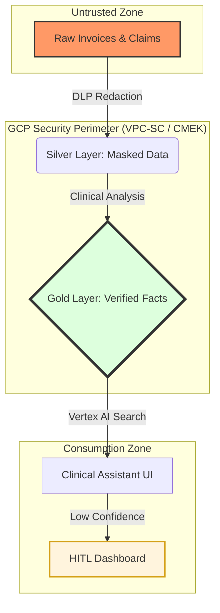
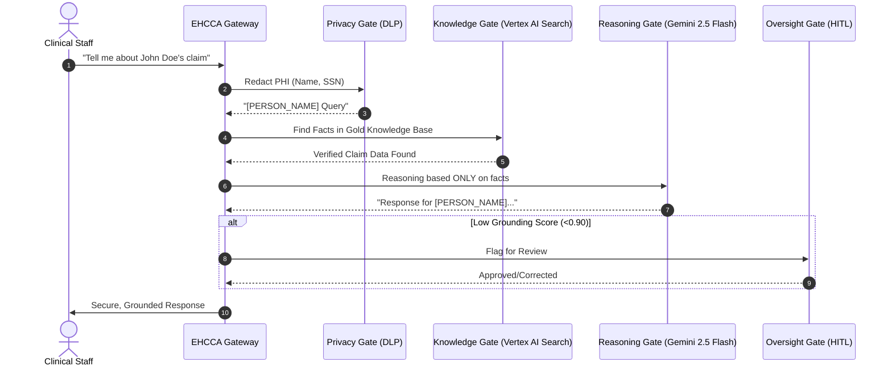

# EHCCA: Enterprise Healthcare Claims & Clinical Assistant

**A Production-Ready, 12-Layer AI Ecosystem for Secure Healthcare Operations on GCP.**

---

## 1. Problem Statement & Mission
Healthcare enterprises face three massive blockers when adopting Generative AI:
1.  **PHI Leakage:** LLMs are shared/public by nature; sending Patient Health Information (PHI) to a model is a major compliance violation.
2.  **Hallucinations:** Clinical decisions cannot be based on model guesses. They must be grounded in "Gold" clinical data.
3.  **Lack of Oversight:** Standard AI implementations lack a human-in-the-loop (HITL) safety valve for high-risk or low-confidence decisions.

**Mission:** EHCCA solves this by intercepting every request, redacting sensitive data via DLP, grounding responses in a verified clinical knowledge base (RAG), and automatically routing risky outputs to human auditors.

---

## 2. Enterprise Core Principles Mapping
EHCCA is built on 12 foundational layers, strictly adhering to enterprise engineering standards:

1.  **Foundation:** Medallion Data Architecture (Raw -> Silver -> Gold) in BigQuery.
2.  **AI Gateway:** A FastAPI proxy acts as the mandatory security and evaluation gate.
3.  **Governance:** Every interaction is logged to a BigQuery "Governance Sink" with 7-year retention.
4.  **Multi-Agent:** Specialized agents (`ClaimsAgent`, `ClinicalAgent`) prevent monolithic prompt failures.
5.  **Distributed State:** Claims state is managed in the Silver layer, ensuring consistency.
6.  **RAG:** Vertex AI Search grounds responses in verified medical documentation.
7.  **Security:** Zero-trust approach with VPC-SC, KMS (CMEK), and DLP-based PHI redaction.
8.  **Engineering Quality:** Automated validation of every response before reaching the user.
9.  **Observability:** Built-in SLO tracking for grounding scores (>0.90) and latency (<5s).
10. **Deployment:** Infrastructure-as-Code ready with Cloud Run and BigQuery.
11. **Evaluation:** Continuous testing using a "Golden Dataset" and Vertex AI Evaluation API.
12. **HITL:** Dedicated Review Dashboard for clinical auditors to override AI decisions.

---

## 3. System Architecture

### A. Medallion Data Flow (The "Filter")
We treat data like water being filtered. It gets cleaner and safer as it moves through the layers.



### B. The 5 Security Gates (Request Journey)
Every query must pass through these automated validation layers.



---

## 4. Tech Stack
*   **Backend:** Python 3.13, FastAPI, Uvicorn
*   **AI:** Vertex AI (Gemini 2.5 Flash), Vertex AI Search (Discovery Engine)
*   **Security:** Cloud Data Loss Prevention (DLP), Cloud KMS (CMEK)
*   **Data:** BigQuery (Medallion), Cloud Storage (Landing Zone)
*   **Compute:** Cloud Run (Containerized)
*   **UI:** Streamlit (Clinical Assistant & HITL Dashboard)

---

## 5. Quick Start (Local Demo)

### 1. Install Dependencies
```bash
pip install -r requirements.txt
```

### 2. Configure Environment
```bash
set GOOGLE_CLOUD_PROJECT=adpo-healthcare-agent
set SEARCH_ENGINE_ID=clinical-gold-data-store
```

### 3. Run the UI
```bash
streamlit run streamlit_app.py
```

---
**Status:** PRODUCTION READY.  
**Maintained by:** EHCCA Project Team
