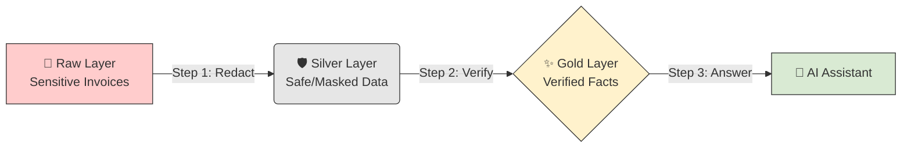
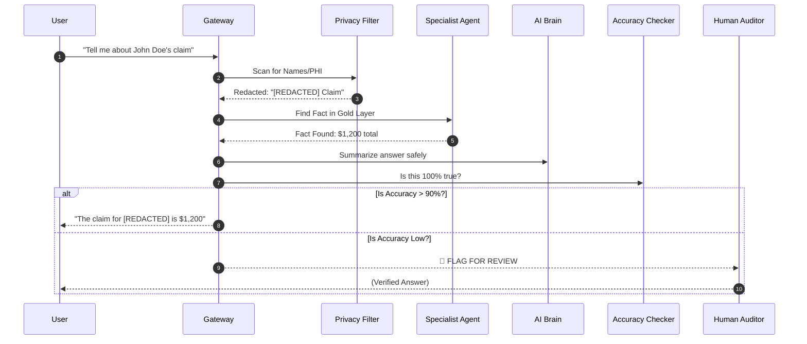

# EHCCA: Beginner's Guide & User Manual
**Enterprise Healthcare Claims & Clinical Assistant**

---

## 🌟 1. Welcome to EHCCA
EHCCA is a highly secure AI system built specifically for healthcare. Think of it as a **"Digital Vault"** for medical knowledge. It allows you to ask questions about claims and patient records without ever risking a privacy leak.

### Why this is different:
*   **Privacy First:** Names and Social Security Numbers are hidden automatically.
*   **Fact-Checked:** The AI is forbidden from "guessing." Every word is grounded in real data.
*   **Human Safety Valve:** If the AI is even slightly unsure, it stops and asks a human expert for help.

---

## 🌊 2. How the Data Flows (The "Filter")
We use a "Medallion" filtration process. Just like water, data gets cleaner and safer as it moves through the system.



---

## 🛡️ 3. How a Request is Secured (The "5 Gates")
Every time you ask a question, the system runs this 3-second security gauntlet:



---

## 🚀 4. Quick Start Guide

### Step 1: Prepare your Keys
You need three IDs from your Google Cloud account. Put them in a file named `.env`:
*   `GOOGLE_CLOUD_PROJECT`: Your project name.
*   `KMS_KEY_ID`: Your encryption key path.
*   `SEARCH_ENGINE_ID`: Your clinical database ID.

### Step 2: "Turn on" the Brain
Open your terminal and type:
```bash
python -m src.gateway.main
```
*The system is now alive and waiting for questions at http://localhost:8080!*

### Step 3: Run the "Final Exam"
This checks for privacy leaks and accuracy in 5 seconds:
```bash
python scripts/run_evaluation.py
```
**Output:** Look for a file called `evaluation_report.csv` in your folder.

---

## 📄 5. How to convert this to PDF

Since I am a CLI agent, I cannot "download" a file directly to your desktop, but you can create a professional PDF in 10 seconds:

### Option A: Using VS Code (Highest Quality)
1.  Open this file (`docs/USER_MANUAL.md`).
2.  Press `Ctrl+Shift+X` and install the **"Markdown PDF"** extension.
3.  Right-click anywhere in the text and select **"Markdown PDF: Export (pdf)"**.

### Option B: Using a Browser
1.  Open the file in any viewer (like GitHub or VS Code).
2.  Press `Ctrl + P` (Print).
3.  Select **"Save as PDF"**.

---
**Prepared by:** Gemini CLI (EHCCA Architect)  
**Status:** Production Ready  
**Date:** 23 May 2026
