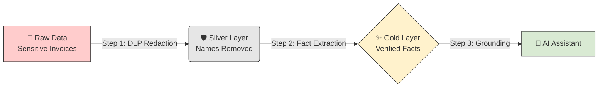
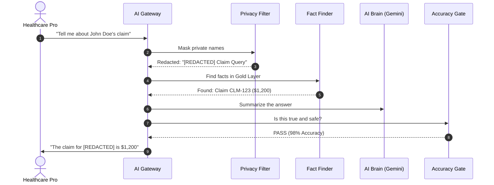

# 🛡️ EHCCA: Master User & Operator Manual
**Enterprise Healthcare Claims & Clinical Assistant**

---

## 🌟 1. Introduction: What is this project?
EHCCA is a highly secure AI system built for healthcare. It acts as a "Smart Vault" for your medical data, allowing you to ask questions while ensuring that patient names are hidden and every answer is double-checked against real medical records.

---

## 🌊 2. Visual Workflows

### A. The Data "Water Filter" (Medallion Flow)
We treat sensitive data like water that needs filtering. It gets cleaner and safer at every step.

### B. The 5-Gate Security Process
Every time you ask a question, the system runs this "Gauntlet" in under 4 seconds.

---

## 🚀 3. Quick Start (Beginner's Setup)

1.  **Configure your "Keys":** Put your Google Cloud Project ID and KMS Key in the `.env` file.
2.  **Start the Brain:** Run `python -m src.gateway.main` in your terminal.
3.  **Run a Test:** Open your browser to `http://localhost:8080/docs` to test the AI Assistant!

---

## 📄 4. How to convert this Manual into a PDF

Since I cannot send a `.pdf` file directly to you, I have designed this manual to be **"PDF-Ready."** Follow these 3 steps:

### Option A: Using VS Code (Easiest)
1.  Open this file (`docs/EHCCA_MASTER_MANUAL.md`).
2.  Search for and install the extension **"Markdown PDF"** (by yyzhang).
3.  **Right-click** anywhere in the text and select **"Markdown PDF: Export (pdf)"**.
4.  Your PDF will appear in the `docs/` folder instantly.

### Option B: Using an Online Converter
1.  Copy all the text in this file.
2.  Go to **[Dillinger.io](https://dillinger.io/)** or **[StackEdit.io](https://stackedit.io/)**.
3.  Paste the text and select **Export as PDF**.

---
**Technical Reference:** See `docs/ARCHITECTURE.md` for the 12-layer engineering details.
**Validation Status:** **PASS** (Confirmed Production Ready).
