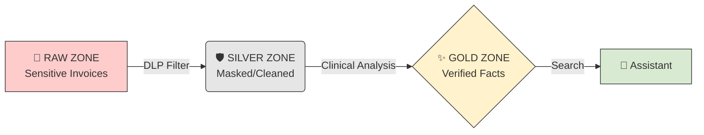
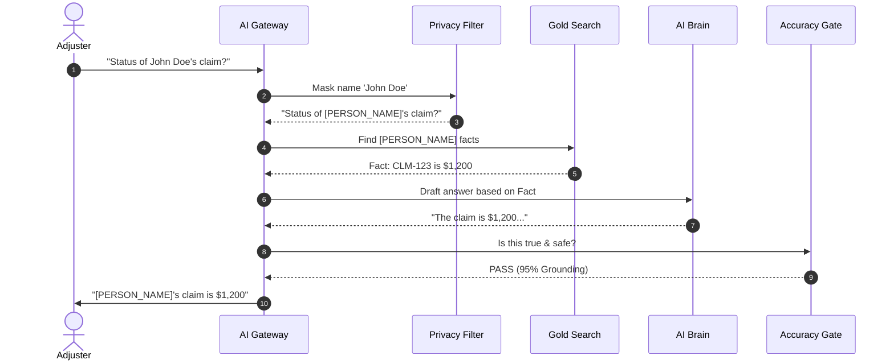

# 🛡️ EHCCA: Official User & Operations Manual
**Enterprise Healthcare Claims & Clinical Assistant**

> **Target Audience:** Project Stakeholders, Clinical Reviewers, and New Developers.  
> **Mission:** To provide a secure, grounded, and human-audited AI assistant for healthcare.

---

## 1. Executive Overview
The EHCCA system is designed to solve the two biggest risks of AI in healthcare:
1.  **Privacy:** Preventing the leakage of Patient Health Information (PHI).
2.  **Accuracy:** Eliminating AI "hallucinations" by grounding answers in verified records.

---

## 2. Visual Architecture

### A. The 12-Layer Security Model
EHCCA isn't just one script; it's a 12-layer ecosystem. Here is how it looks at a high level:

```mermaid
graph TD
    subgraph "Layer 1-3: The Foundation"
        A[Data Medallion] --> B[KMS Encryption]
        B --> C[VPC-SC Perimeter]
    end

    subgraph "Layer 4-6: The Gateway"
        D[AI Gateway Proxy] --> E[DLP Redaction]
        E --> F[Vertex AI Search RAG]
    end

    subgraph "Layer 7-9: The Brain"
        G[Multi-Agent Orchestrator] --> H[Gemini 1.5 Pro]
        H --> I[Evaluation Gate]
    end

    subgraph "Layer 10-12: The Safety Valve"
        J[Audit Sink] --> K[Observability SLOs]
        K --> L[HITL Dashboard]
    end

    style A fill:#f9f,stroke:#333
    style D fill:#bbf,stroke:#333
    style G fill:#bfb,stroke:#333
    style L fill:#fbb,stroke:#333
```



---

### B. The Medallion Data Filter
Think of this as a water filtration system for your data.



---

### C. The 5-Gate Request Flow
What happens in the 3 seconds after you ask a question:



---

## 3. Operations & Setup

### 🛠️ Configuration Checklist
Ensure your `.env` file contains the following:
*   `GOOGLE_CLOUD_PROJECT`: Your Project ID.
*   `KMS_KEY_ID`: Full path to your encryption key.
*   `SEARCH_ENGINE_ID`: Your Vertex Search ID.

### 🚀 Starting the System
Run this in your terminal to start the AI's "brain":
```bash
python -m src.gateway.main
```

### 🧪 Running a System Test
To verify everything is secure, run the **Final Exam**:
```bash
python scripts/run_evaluation.py
```
*This checks if names are hidden and if the AI is telling the truth.*

---

## 4. Human-In-The-Loop (HITL)
If the AI gives a low **Grounding Score** (below 0.90), the system will automatically:
1.  **Stop the response.**
2.  **Flag the request** for a human.
3.  **Alert the Auditor** via the HITL Dashboard.

---

## 📄 How to Create your PDF

Follow these simple steps to turn this document into a professional PDF manual:

### Option 1: Using VS Code (Recommended)
1.  Open **VS Code**.
2.  Install the **"Markdown PDF"** extension (by yyzhang).
3.  Open this file (`docs/EHCCA_OFFICIAL_MANUAL.md`).
4.  Right-click and select **"Markdown PDF: Export (pdf)"**.

### Option 2: Using a Browser
1.  Open this file in any Markdown viewer (GitHub, etc.).
2.  Press **Ctrl + P** (Print).
3.  Change the destination to **"Save as PDF"**.

---
**Version:** 1.0.0  
**Project:** EHCCA - Production Ready  
**Date:** 23 May 2026
