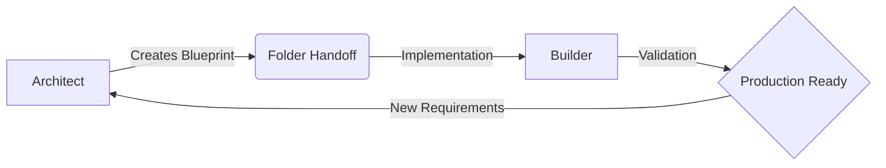
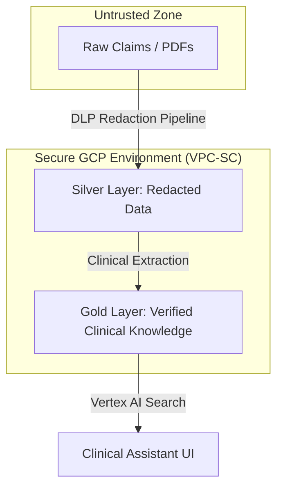
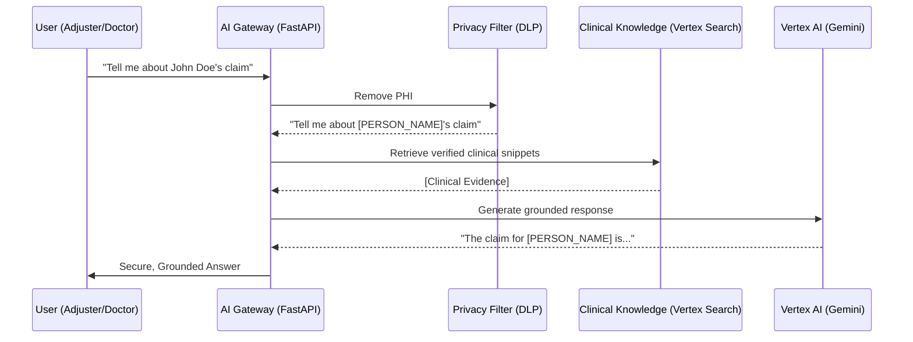

# EHCCA Operations Manual: A Beginner's Guide
**Enterprise Healthcare Claims & Clinical Assistant**

This manual provides a step-by-step guide on how to set up, operate, and maintain the EHCCA system using the **120x Architect/Builder Methodology**.

---

## 1. The 120x Philosophy
EHCCA was built using a separation of concerns. This ensures that security decisions are made before a single line of code is written.

### The Architect/Builder Lifecycle


---

## 2. System Architecture
EHCCA protects Patient Health Information (PHI) by filtering it through multiple layers.

### Data Medallion Flow


---

## 3. Getting Started (Setup)

### Step 1: GCP Configuration
You must have a Google Cloud Project with the following enabled:
*   **Vertex AI API**
*   **Sensitive Data Protection (DLP) API**
*   **BigQuery & Cloud Storage**

### Step 2: Environment Setup
1.  Install Python 3.9+
2.  Set your environment variables in a `.env` file:
    ```text
    GOOGLE_CLOUD_PROJECT=your-project-id
    KMS_KEY_ID=projects/your-project/locations/us-central1/keyrings/ehcca-keyring/cryptoKeys/ehcca-phi-key
    SEARCH_ENGINE_ID=your-search-engine-id
    ```

---

## 4. Operational Workflows

### How a User Request is Protected
When a user asks a question, the **AI Gateway** acts as a security proxy.



---

## 5. Testing & Validation

### End-to-End Evaluation
Run the following command to verify the system against the **Golden Dataset**:
```bash
python scripts/run_evaluation.py
```
This script checks:
1.  **PHI Redaction:** Does the system successfully hide names?
2.  **Grounding:** Is the answer based on real data?
3.  **HITL Triggers:** Do risky answers go to the human dashboard?

---

## 6. Human-In-The-Loop (HITL) Dashboard
If the AI is unsure, it triggers a human review. 

**Reviewer Actions:**
*   **Approve:** Release the AI response to the user.
*   **Edit:** Correct clinical errors before release.
*   **Reject:** Block the response for safety reasons.

---

## 7. Converting to PDF
To share this manual as a PDF:
1.  Open **VS Code**.
2.  Install the **"Markdown PDF"** extension by yyzhang.
3.  Open `docs/EHCCA_OPERATIONS_MANUAL.md`.
4.  Press `Ctrl+Shift+P` and type **"Markdown PDF: Export (pdf)"**.

---
*For technical implementation details, refer to `docs/ARCHITECTURE.md`.*
