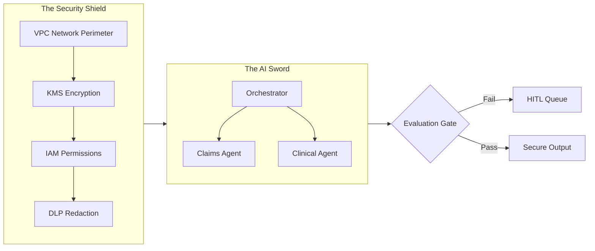
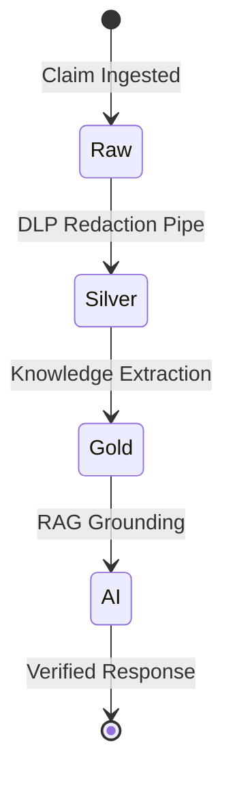
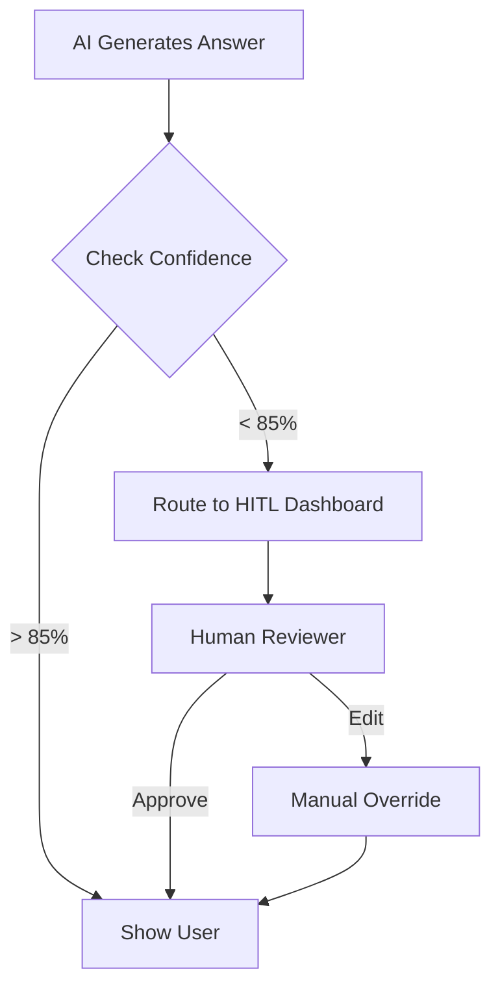

# 📘 EHCCA Master Playbook
> **Enterprise Healthcare Claims & Clinical Assistant**  
> *The 120x Blueprint for Secure, Grounded, and Compliant AI*

---

## 1. Executive Summary
EHCCA is not just a chatbot; it is a **secure reasoning engine**. It automates the extraction of clinical insights and claim statuses while ensuring that sensitive **Patient Health Information (PHI)** never touches an unmasked AI model.

### The Value Proposition
*   **Safety First:** Zero PHI leakage via automated DLP redaction.
*   **Trust Second:** Every answer is "Grounded" in real medical records.
*   **Humans Third:** Risky decisions are automatically sent to human experts.

---

## 2. Visualizing the Architecture
Below is the "Shield & Sword" model of EHCCA. The **Shield** protects the data; the **Sword** (Agents) processes it.

### The 12-Layer Security Shield

---

## 3. How it Works: The "Medallion" Data Flow
We filter data like water. Only the cleanest, most verified data reaches the user.

| Layer | Analogy | What happens? |
|---|---|---|
| **Raw** | Muddy Water | Invoices and records exactly as they arrived. |
| **Silver** | Filtered Water | Names and SSNs are hidden; data is organized. |
| **Gold** | Pure Water | Medical facts are extracted for the AI to "read." |

---

## 4. A Day in the Life: How to Use EHCCA

### Scenario A: For the Claims Adjuster
> *"Has John Doe's claim for the surgery last week been paid?"*

1.  **DLP Gate:** Automatically changes the name to `[PERSON_NAME]`.
2.  **Orchestrator:** Sees the word "Paid" and calls the **Claims Agent**.
3.  **Claims Agent:** Searches the Silver BigQuery table.
4.  **Result:** "Claim CLM-123 for $1,500 was PAID on May 20th."

### Scenario B: For the Clinical Auditor
> *"What is the patient's history of hypertension?"*

1.  **Orchestrator:** Calls the **Clinical Agent**.
2.  **RAG Gate:** Pulls 5 snippets from the **Gold Layer** medical records.
3.  **Evaluation Gate:** Checks if the AI is "hallucinating."
4.  **Result:** AI provides a summary **with citations** to the original documents.

---

## 5. The "Safety Valve" (HITL)
If the AI is ever "confused" (Accuracy < 85%) or the claim is too high (> $5,000), it stops.

---

## 6. Setup & Testing Guide

### 🛠 Quick Setup
1.  **Open your Terminal.**
2.  **Set your Key:** `export KMS_KEY_ID="your-key-path"`
3.  **Launch the Brain:** `python -m src.gateway.main`

### 🧪 Basic Tests
*   **To test Ingestion:** Run `python scripts/simulate_ingest.py`
*   **To test Accuracy:** Run `python scripts/run_evaluation.py`

---

## 7. Compliance Checklist
- [x] **CMEK Encryption** enabled on all storage?
- [x] **DLP Redaction** active on all prompts?
- [x] **Audit Logging** streaming to BigQuery?
- [x] **VPC Service Controls** in Enforced mode?

---
**Prepared by:** Gemini CLI Architect  
**Methodology:** 120x Architect / Builder
