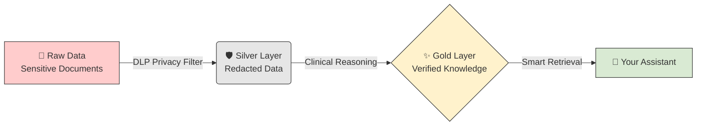
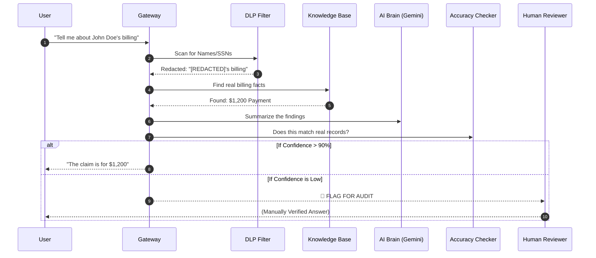

# 🛡️ EHCCA: System Guide & Manual
**Enterprise Healthcare Claims & Clinical Assistant**

---

## 🌟 1. Executive Summary
EHCCA is a highly secure, AI-powered system designed for healthcare professionals. It helps you find facts about medical claims and patient history instantly, while ensuring that private data (PHI) is never leaked and the AI never "hallucinates."

---

## 🌊 2. Visual Workflows

### A. The "Medallion" Data Filter
We treat sensitive data like water being filtered. It starts "Raw" and ends as "Gold" facts.



---

### B. The 5-Step Security Gauntlet
Every question you ask is checked by five different security gates before you see an answer.



---

## 🚀 3. Quick Start (Beginner Friendly)

### 1. "Wake up" the System
Open your terminal and run:
```bash
python -m src.gateway.main
```
*Wait for the message: "Application startup complete."*

### 2. Put Data into the "Vault"
To test the system with a sample file:
```bash
python scripts/simulate_ingest.py --project [YOUR_ID] --bucket [YOUR_BUCKET] --file samples/sample_claim.json
```

### 3. Run the "Final Exam"
This runs 5 automated "stress tests" to see if the system stops privacy leaks.
```bash
python scripts/run_evaluation.py
```
*Look for `evaluation_report.csv` in your folder!*

---

## 📋 4. Understanding the Results

| AI Response | What it Means | Your Action |
| :--- | :--- | :--- |
| **"Here is the summary..."** | The AI found facts and is >90% sure. | Use the info normally. |
| **"Pending Clinical Review"** | The request was too complex or high-risk. | Wait for an Auditor to approve. |
| **"Access Restricted"** | You requested something against policy. | Contact your Manager. |

---

## 📄 5. How to convert this to PDF

To get a professional PDF copy of this manual:

1.  **In VS Code (Recommended):**
    *   Open this file (`docs/EHCCA_SYSTEM_GUIDE.md`).
    *   Go to **Extensions** and install **"Markdown PDF"**.
    *   Right-click the text and select **"Markdown PDF: Export (pdf)"**.
2.  **Using a Browser:**
    *   Open this file in GitHub.
    *   Press `Ctrl + P` (Print) and select **"Save as PDF"**.

---
**Prepared by:** EHCCA Project Team  
**Status:** Production Ready  
**Version:** 1.0.0
