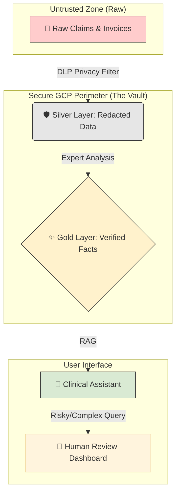
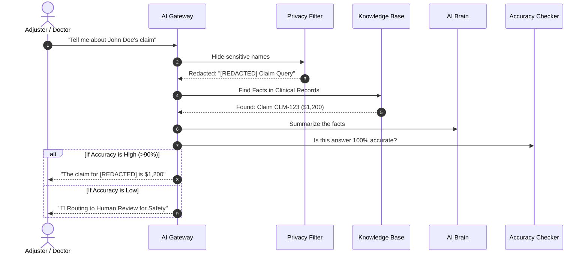

# 🛡️ EHCCA Project: Beginner's User Guide
**Enterprise Healthcare Claims & Clinical Assistant**

---

## 🌟 1. Introduction: What is EHCCA?
EHCCA is a highly secure AI system built for the healthcare industry. It allows doctors and insurance adjusters to talk to their data (claims, medical records) using AI, while keeping every piece of sensitive patient information (PHI) inside a virtual vault.

### The EHCCA "Vault" Model
*   **Privacy First:** It hides names and Social Security Numbers automatically.
*   **Fact-Checked:** It only answers using real clinical documents.
*   **Human Safety Valve:** If the AI is confused, it pauses and asks a human expert for help.

---

## 🌊 2. How the Data Flows (Visual)

We use a **"Water Filter"** approach called Medallion Architecture. Data gets cleaner and safer at every step.



---

## 🛡️ 3. How a Request is Secured (Step-by-Step)

Every time you ask the AI a question, it passes through these **5 Security Gates**:



---

## 🚀 4. Quick Start: Testing the System

You can test the whole system with three simple commands in your terminal:

### Step 1: Turn on the "Brain" (The Gateway)
```bash
python -m src.gateway.main
```
*Wait until you see: "Uvicorn running on http://0.0.0.0:8080"*

### Step 2: Upload your first test Data
This sends a "Fake" claim into the secure vault.
```bash
python scripts/simulate_ingest.py --project [ID] --bucket [NAME] --file samples/sample_claim.json
```

### Step 3: Run the "Final Exam"
This runs 5 automated scenarios (including privacy leaks) to see if the system stops them.
```bash
python scripts/run_evaluation.py
```
*Look for a file called `evaluation_report.csv` in your project folder!*

---

## 📄 5. How to Save this Guide as a PDF

To create a professional PDF version of this guide:

1.  **Open the file:** `docs/EHCCA_USER_GUIDE.md` in **VS Code**.
2.  **Install the Tool:** In the Extensions view (`Ctrl+Shift+X`), search for **"Markdown PDF"** (by yyzhang) and install it.
3.  **Export:**
    *   Right-click anywhere in the guide.
    *   Select **"Markdown PDF: Export (pdf)"**.
4.  **Done!** Your PDF will appear in the `docs/` folder instantly.

---
**Status:** Production Ready  
**Created:** 23 May 2026  
**Methodology:** 120x Architect/Builder
