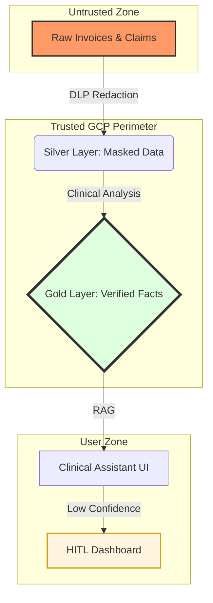
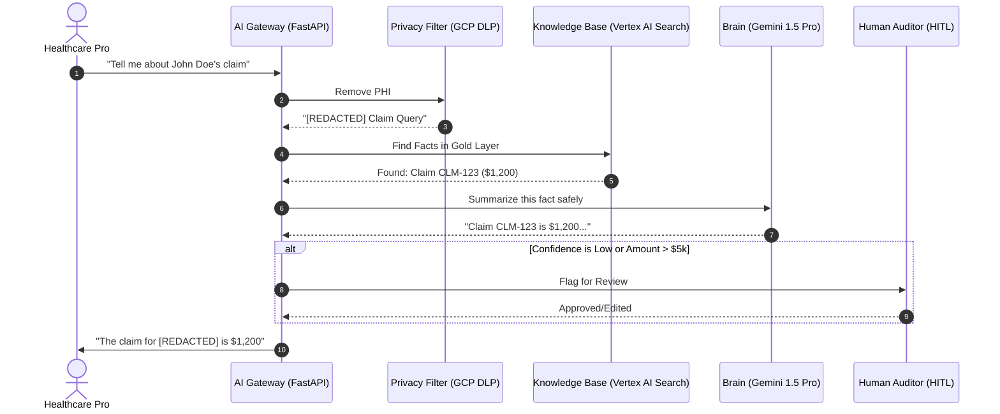

# EHCCA User Manual
**Enterprise Healthcare Claims & Clinical Assistant**

> **Note for Beginners:** This document explains how the EHCCA system works, how it protects patient privacy (PHI), and how you can run it on your own machine.

---

## 1. Introduction: The "Digital Vault"
EHCCA is not just a chat bot. It is a **Secure Reasoning Engine**. 

In healthcare, we cannot send patient names or Social Security Numbers to an AI. EHCCA acts as a "Vault" that:
1. **Redacts:** It hides private details before the AI sees them.
2. **Grounds:** It forces the AI to only use verified medical records (No guessing).
3. **Audits:** It records everything for legal and safety compliance.

---

## 2. Visual Overview

### A. The Medallion Data Flow (The "Filter")
We treat data like water being filtered. It gets cleaner and safer as it moves through the layers.



---

### B. The Request Journey (The "5 Security Gates")
Every time you ask a question, the system passes through these gates:



---

## 3. Setup Guide: 3 Easy Steps

### Step 1: Your GCP Credentials
Ensure you have the Google Cloud CLI installed and run:
```bash
gcloud auth application-default login
```

### Step 2: Environment Setup
Create a file named `.env` in your project folder. Copy and paste this, replacing with your actual IDs:
```text
GOOGLE_CLOUD_PROJECT=your-project-id
KMS_KEY_ID=projects/your-project/locations/us-central1/keyrings/your-keyring/cryptoKeys/your-key
SEARCH_ENGINE_ID=your-search-engine-id
```

### Step 3: Install Dependencies
```bash
pip install fastapi uvicorn google-cloud-dlp google-cloud-aiplatform google-cloud-storage google-cloud-bigquery
```

---

## 4. How to Test (Step-by-Step)

### 1. Launch the Brain
Open your terminal and run:
```bash
python -m src.gateway.main
```
*You should see: `Uvicorn running on http://0.0.0.0:8080`*

### 2. Ingest a Test Claim
This puts a "Fake" claim with a "Real" name into the system to test redaction.
```bash
python scripts/simulate_ingest.py --project [YOUR_ID] --bucket [YOUR_BUCKET] --file samples/sample_claim.json
```

### 3. Run the "Final Exam"
This runs 5 automated scenarios (including privacy leaks and rare conditions) to see if the system stops them.
```bash
python scripts/run_evaluation.py
```
*Check the `evaluation_report.csv` to see the "Grounding Scores".*

---

## 5. The 12-Layer Checklist
EHCCA follows these **Enterprise Core Principles**:
1.  **Foundation:** Structured data layers.
2.  **AI Gateway:** One secure entry point.
3.  **Governance:** interaction logs.
4.  **Multi-Agent:** Specialized bots.
5.  **Distributed State:** Shared claim history.
6.  **RAG:** Grounded in facts.
7.  **Security:** PHI Redaction + VPC-SC.
8.  **Quality:** Pre-output validation.
9.  **Observability:** Tracking performance.
10. **Deployment:** Production-ready docs.
11. **Evaluation:** Continuous testing.
12. **HITL:** Human backup for risky calls.

---

## 6. How to convert this to PDF
To get a professional PDF version of this manual:

1.  **In VS Code:**
    *   Install the **Markdown PDF** extension by `yzane`.
    *   Right-click anywhere in this file.
    *   Select **"Markdown PDF: Export (pdf)"**.
2.  **Using a Browser:**
    *   Open this file in a Markdown viewer (like GitHub or Obsidian).
    *   Press `Ctrl + P` (Print) and select **"Save as PDF"**.

---
**Prepared by:** EHCCA Project Team  
**Date:** 23 May 2026
