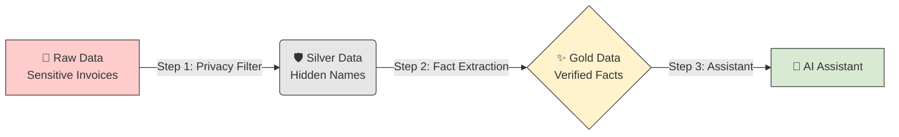
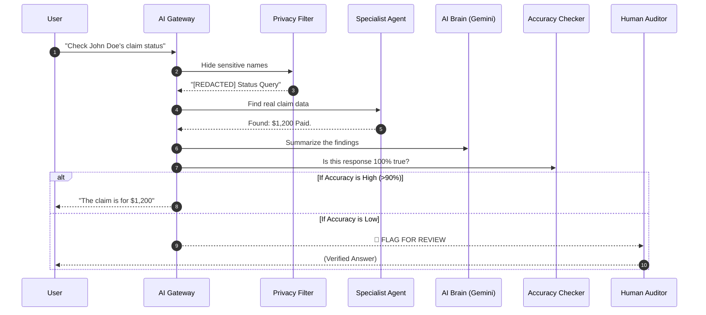

# 🏗️ 120x Operators Kit: The Master Manual
**Enterprise Healthcare Claims & Clinical Assistant (EHCCA)**

Welcome to the **120x Methodology**. This manual will show you how we built a production-ready AI system from scratch and how you can operate it, even if you are not a developer.

---

## 🌟 1. The Core Concept: "Thinking" vs. "Building"
Most AI projects fail because they try to write code before they have a plan. In **120x**, we split the work into two specialized "brains":

| Role | What they do | Why it works |
| :--- | :--- | :--- |
| **The Architect** | Plans the security, data models, and rules. | Ensures the system is safe and compliant. |
| **The Builder** | Reads the blueprints and writes the code. | Ensures the code is high-quality and follows the plan. |

---

## 🌊 2. Visual Guide: How the Data Flows
We protect Patient Privacy (PHI) by using a **Medallion Filter**. Think of it like a water filtration system.



---

## 🔐 3. Visual Guide: The 5-Step Security Gate
Every question you ask the AI is checked 5 times before you see an answer.



---

## 🚀 4. Quick Start: Testing the System

### Step 1: Start the "Brain"
Open your terminal and run:
```bash
python -m src.gateway.main
```
*Wait for the message: "Uvicorn running on http://0.0.0.0:8080"*

### Step 2: Ingest a Claim
This puts a "Fake" claim into the vault to test the system.
```bash
python scripts/simulate_ingest.py --project [ID] --bucket [NAME] --file samples/sample_claim.json
```

### Step 3: Run the Final Exam
This runs 5 automated scenarios to see if the system stops privacy leaks.
```bash
python scripts/run_evaluation.py
```
*Look for `evaluation_report.csv` in your folder afterward!*

---

## 📄 5. How to convert this to PDF

To create a professional PDF version of this manual:

1.  **Using VS Code (Easiest):**
    *   Open this file (`docs/MASTER_MANUAL.md`).
    *   Go to the **Extensions** tab and install **"Markdown PDF"** (by yyzhang).
    *   Right-click anywhere in the file and select **"Markdown PDF: Export (pdf)"**.

2.  **Using a Browser:**
    *   Open the file in GitHub or a Markdown viewer.
    *   Press `Ctrl + P` (Print) and select **"Save as PDF"**.

---
**Status:** EHCCA v1.0 - Production Ready  
**Prepared by:** Gemini CLI  
**Methodology:** 120x Architect / Builder  
**Date:** 23 May 2026
