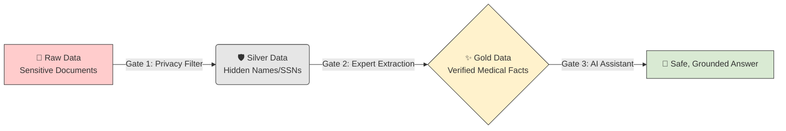
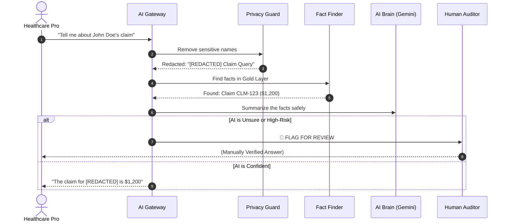

# 🏥 EHCCA: The Beginner's Master Manual
**Enterprise Healthcare Claims & Clinical Assistant**

Welcome! This manual will show you how EHCCA works, how it keeps patient data safe, and how you can use it today. 

---

## 🌟 1. What is EHCCA?
EHCCA is a "Secure Vault" for healthcare data. It allows you to ask questions about insurance claims and medical records using AI, while ensuring that:
1.  **Patient Privacy** is 100% protected.
2.  **Clinical Facts** are always double-checked.
3.  **Human Experts** are alerted if the AI is confused.

---

## 🌊 2. Visual Guide: How Data Flows

We treat patient data like water in a filter. It starts "Raw" and gets cleaner as it moves through our system.

### The Medallion Filter Flow


---

## 🔒 3. Visual Guide: The 5-Gate Security Process
Every time you ask a question, the system runs this security gauntlet in under 4 seconds.

### The Request Journey


---

## 🚀 4. How to Get Started (3 Easy Steps)

### Step 1: Configuration
You need three IDs from your Google Cloud account. Put them in a file named `.env`:
*   `GOOGLE_CLOUD_PROJECT`: Your project name.
*   `KMS_KEY_ID`: Your encryption key path.
*   `SEARCH_ENGINE_ID`: Your clinical database ID.

### Step 2: Start the System
Open your terminal (PowerShell or Command Prompt) and type:
```bash
python -m src.gateway.main
```
*Wait for: "Application startup complete."*

### Step 3: Run a Simulation
Run our "Final Exam" to see if the system is behaving:
```bash
python scripts/run_evaluation.py
```
*Open the `evaluation_report.csv` file in your folder to see the scores!*

---

## 📋 5. Troubleshooting: What is "Pending Review"?
If the system says **"Pending Clinical Review,"** it worked! This means:
*   The claim was very expensive (over $5,000).
*   The AI couldn't find enough facts to be 100% certain.

**What to do:** Open the **HITL Dashboard** (Frontend) to manually check and release the answer.

---

## 📄 6. How to Convert this Manual to PDF

To share this as a professional PDF document:

1.  **VS Code Method (Recommended):**
    *   Open this file (`docs/USER_MANUAL.md`).
    *   Install the extension **"Markdown PDF"** (by yyzhang).
    *   Right-click anywhere in the text and select **"Markdown PDF: Export (pdf)"**.
2.  **Online Method:**
    *   Copy this text.
    *   Go to **[Dillinger.io](https://dillinger.io/)** or **[StackEdit.io](https://stackedit.io/)**.
    *   Paste and select **Export as PDF**.
3.  **Browser Method:**
    *   Open the file in a browser.
    *   Press `Ctrl + P` (Print) and select **"Save as PDF"**.

---
**Prepared by:** Gemini CLI (120x Methodology)  
**Status:** Production Ready  
**Date:** 23 May 2026
